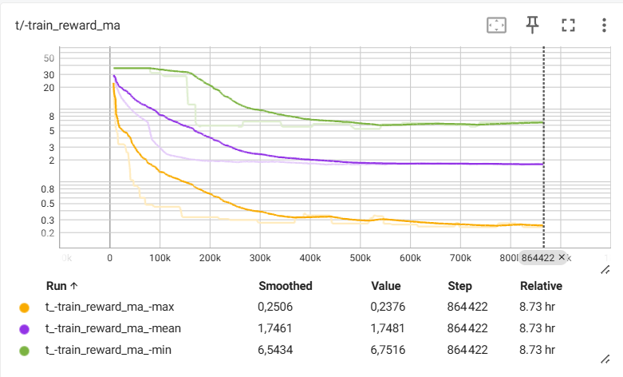

# Drone Control 2D RL 🚁

**Author:** Isaac Nivet

Sneak peak at the end result:

https://github.com/user-attachments/assets/478e57de-5fc4-4633-86f9-02ff1bc27010

---

⭐ The project consists in training an agent to control a virtual drone in a realistic 2D environment that I made. The environment has realistic physics, such as gravity, air drag, torque, etc.

It is honestly pretty hard to control such a drone! (You can try it yourself by running `python src/Game.py`, and controlling the drone with `A`/`Q` for the left propeller, and `P`/`M` for the right one.)

This difficulty makes it very interesting for a reinforcement learning (RL) project, since it is very hard to hand-engineer rules that would stabilize a drone running in an unstable environment submitted to the weather, let alone make it perform a specific movement.

## Environment

I used Python 3.11 and CUDA 12.6. Installations suggestions are in [env/readme.md](env/readme.md).

## How it works

### Algorithm

The algorithm used is [SAC (Soft Actor-Critic)](https://spinningup.openai.com/en/latest/algorithms/sac.html), which is a popular algorithm for continuous action spaces. It is fairly tricky to understand and to implement, but once it's set up, it's very powerful. Some of the best reasons for using SAC would be:

- Works on continuous action spaces (most important, mandatory criteria)
- Entropy depends on a learnt parameter, which allows the agent to automatically decide to explore more or less depending on where it thinks it is in the training process. That makes it more convenient to use than others, like PPO, DDPG, etc.
- It is an off-policy algorithm, which means that the agent can learn from past experiences, and not just the ones it has experienced very recently. It means there is a very high data efficiency.

### Reward function

RL algorithms need a reward function to learn. A reward function is a function that takes the current state of the environment and the action taken by the agent, and returns a number that represents how good or bad the action was. Typically, the better the action, the higher the reward.

In this project, we used two kinds of training episodes:

- `StopEpisode`: the agent is rewarded for stopping the drone and staying still.
- `StraightLineEpisode`: the agent is rewarded for moving in a given direction at a given speed. Those direction and speed randomly vary during the episode, so the agent learns realistic direction changes.

Although simple, I was surprised to find that these two kinds of episodes are enough to train a robust drone controller agent.

### Recurrence

All of those exercises are tricky for a drone evolving under wind and rain conditions that are out of its control, because they can derive it horizontally, vertically, and make it hard for the drone to remain static. For this precise reason, the agent has a LSTM component, which allows it to infer how it is being moved by external forces, and to compensate for it. Therefore, the drone can be observed being near perfectly static even though strong winds (up to 10 m/s) and rain (up to 10 mm/h) are blowing on it.

## Training

To train the agent, run `python src/train.py`. Since RL training does not really have a clear end, training is never ending. It periodically saves a checkpoint of the last model. It also saves a checkpoint of the best model found so far. You can resume a previous training by running `python src/train.py --resume`. I advise to also run it with `--nogui` to avoid the GUI showing the drone during testing, because it slows down the training.

You can visualize the performance of the agent you trained by running the notebook `notebooks/test_model.ipynb`, which will load the best checkpoint created by `train.py` during the training process.

## Results

After 6 hours of training on a RTX 3060, I ended up with a very capable AI that can go in the intended direction, at the intended speed, reliably with a margin of error of 0.01 m/s, even with any kind of wind or rain.

You can see that the reward seems to have reached a maximum on average, and does not seem like it can do better.

🎬 The video you can see at the beginning of the README is a video of me playing with the trained agent, controlling it with my keyboard. For example, pressing Z and Q would make it go 5 m/s to the top, and 5 m/s to the left.

## Future work

The current agent is pretty lightweight, it is about 1 Mo, but it might be interesting to try to make it even smaller, like 100 Ko and see if it can still perform the same, or 10x bigger and see if can be more precise.
